# Dokumentasi Sistem Informasi Pengelolaan PKL/Magang (Sistem Administrator)

## 1. Halaman Utama

Pada halaman utama, user dapat melihat informasi singkat mengenai web Manajemen Organisasi Mahasiswa dan user dapat melihat informasi umum organisasi-organisasi mahasiswa di fakultas, seperti logo organisasi, nama organiasasi (singakatan dan kepanjangan). Dimana user dapat menekan card organisasi untuk diarahkan ke halaman dari organisasi tersebut. Kemudian terdapat navbar berbasis single page dan footer.

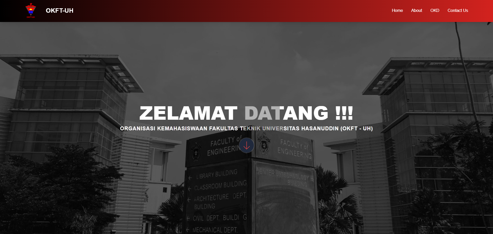
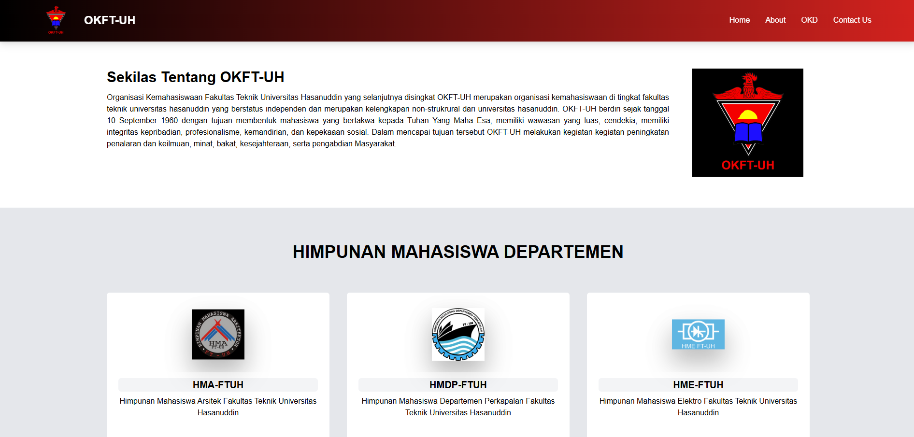
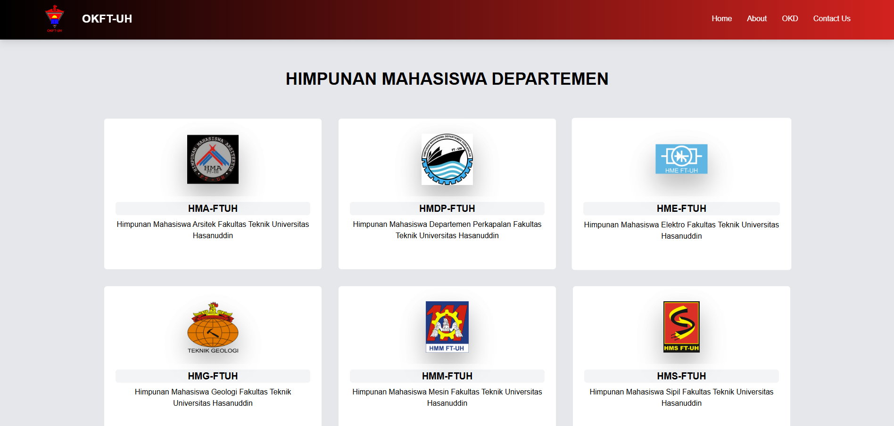
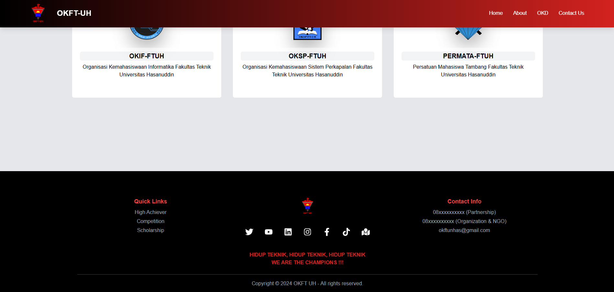

---

## 2. Halaman Organisasi

Pada Halaman Organisasi, user dapat melihat detail dari organisasi tersebut, seperti logo organiasasi, nama organisasi, deskripsi, visi dan misi, struktur organisasi, dan anggota dari organisasi tersebut. Dan terdapat button "Agenda Kegiatan Kami" yang akan mengarahkan user menuju ke halaman agenda organisasi tersebut.

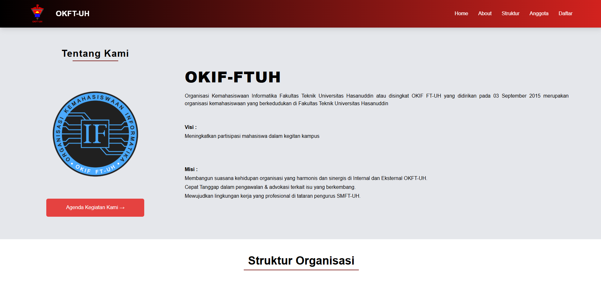
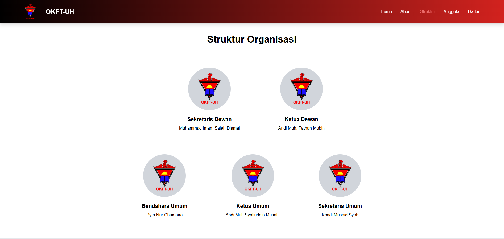
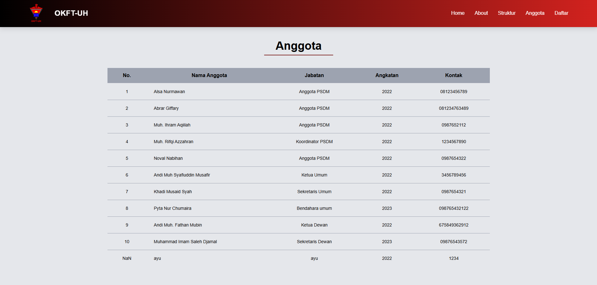

---

## 3. Halaman Agenda Kegiatan

Pada halaman agenda kegiatan, user dapat melihat daftar-daftar agenda yang dimiliki oleh organisasi dalam bentuk card. Informasi agenda meliputi gambar kegiatan, nama kegiatan, deskipsi singkat kegiatan, tanggal registrasi, tanggal dan waktu kegiatan, lokasi kegaitan, dan status pendaftaran dari kegiatan tersebut. Dan terdapat button "Detail" yang akan mengarahkan user ke halaman Detail Agenda Kegiatan.

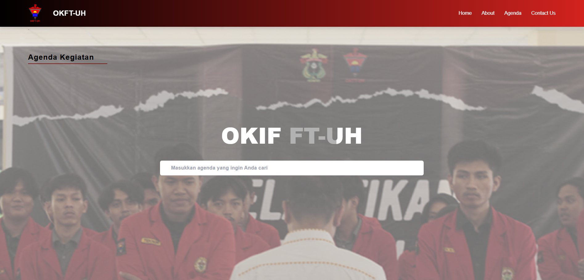
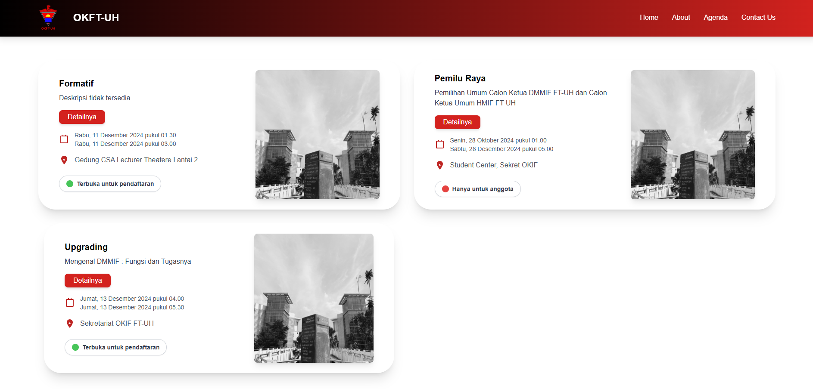

---

## 4. Halaman Detail Agenda Kegiatan

Pada halaman detail agenda kegiatan, user dapat melihat lebih detail mengenai kegiatan tersebut, seperti nama kegiatan, deskripsi kegiatan, tanggal mulai dan selesai, lokasi, gambar kegiatan, organisasi yang terlibat, dan pembicara atau pengisi acara dari kegiatan tersebut.

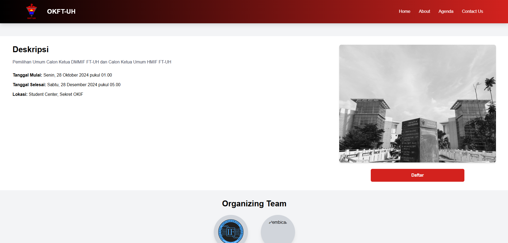
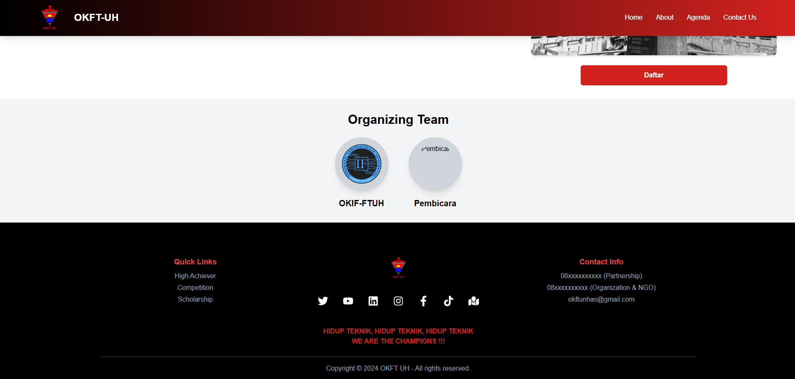